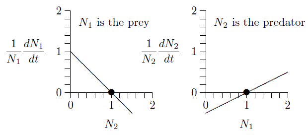
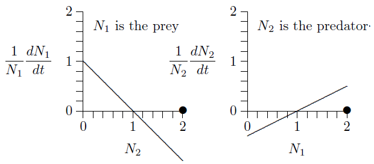

---
jupytext:
  text_representation:
    extension: .md
    format_name: myst
kernelspec:
  display_name: r
  language: r
  name: ir
---

# Predator and prey

Competition and mutualism can be understood without much attention to the sizes
of the species involved. But predation is quite different. Think of a producer,
the prey, and a consumer, the predator. When the consumer is extremely large and
the producer very small, as with a whale and krill, the relationship is called
filter feeding. There the predator kills the prey. When the producer and
consumer are roughly matched in size, they are called predators and prey. When
the producer is much smaller than the consumer, but still independently mobile,
the relationship is called parasitism. And when the consumer is much smaller
still, and has difficulty moving around on its own, the relationship is called
infection and disease. Symptoms of disease are part of the ecology of disease.
In parasitism and disease, the consumer often does not kill the producer.

### Further examples of predation

Amazing mechanisms for both capturing prey and avoiding predators have
been discovered through evolution.
Fulmar chicks[*](https://en.wikipedia.org/wiki/Fulmar), for example, can direct
"projectile vomit" at predators approaching the nest too closely
(Figure [12.1](#fig_12_1_tag)). This is not just icky for the predator. By
damaging the waterproofing of an avian predator's feathers, this ultimately can
kill the predator. The chick's projectile vomit is thus a lethal weapon.

<a name="fig_12_1_tag"></a>

```{figure} ../img/downer/p101.jpg
---
name: fig_12_1
alt: fig_12_1
width: 500px
align: center
---
Fulmer chick with projectile vomit as predator defense.
```

One of the most remarkable predatory weapons is that of
[pistol shrimp](https://en.wikipedia.org/wiki/Alpheidae) (Figure [12.2](fig_12_2).)
These shrimp have one special claw adapted to cavitation, and are capable of shooting bullets at their
prey; colonies of these shrimp are loud from the sound of these bullets. But
where does an underwater crustacean get bullets? Actually, it creates them from
nothing at all---from cavitation. If you've ever piloted a powerful motorboat
and pushed the throttle too hard, or watched a pilot do so, you've seen the
propellers start kicking out bubbles, which look like air bubbles. But the
propellers are well below the water line, where there is no air. The propellers
are in fact creating bubbles of vacuum---separating the water so instantly that
there is nothing left in between, except perhaps very low density water vapor.
Such bubbles collapse back with numerous blasts, each so powerful that it rips
off pieces of bronze off the propeller itself, leaving a rough surface that is
the telltale sign of cavitation.

```{figure} ../img/fairuse/PistolShrimp.jpg
---
name: fig_12_2
alt: fig_12_2
width: 500px
align: center
---
Pistol-packing shrimp shoot cavitation bullets.
```

A pistol shrimp snap its pistol claw together so quickly that it creates a vacuum
where water used to be. With the right circulation of water around the vacuum
bubble, the bubble can move, and a shrimp can actually project its bullet of
vacuum toward its prey. When the bubble collapses, the effect is like thunder
attending a lightning bolt, when air snaps together after the lightning has
created a column of near-vacuum ([NatGeo video](https://www.youtube.com/watch?v=KkY_mSwboMQ)). But the consequences are quite different in
water. While a loud sound might hurt the ears of a terrestrial animal, the sound
does not rip apart the fabric of the animal's body. This is, however, what
intense sounds in water can do, traveling through water and through the
water-filled bodies of animals. In effect, pistol shrimp shoot bullets that
explode near their prey and numb them into immobility. Somehow evolution
discovered and perfected this amazing mechanism!

```{figure} ../img/fig12_3.png
---
name: fig_12_3
alt: fig_12_3
width: 700px
align: center
---
Rifle-carrying humans shoot lead bullets---bison bones and remnant herd.
```

The ultimate weapons of predation, however, are those of our own species.
Figure [12.3](fig_12_3) (right) shows a remnant bison herd, a few
hundred of the hundreds of millions of bison that migrated the plains not many
generations ago. No matter how vast their numbers, they were no match for
gunpowder and lead bullets, and they dropped to near extinction by the beginning
of the twentieth century. The image at the left illustrates the epic efficiency
of lead bullets by showing a nineteenth-century pile of bison bones, with
members of the predator species positioned atop and aside.

### Ecological communities are complex

Before proceeding with simplified models of predation, we want to stress that
ecological communities are complex (Figure [12.4](fig_12_4)).
Fortunately, progress in understanding them comes piece by piece. Complex food
webs, like the one illustrated in the figure, can be examined in simpler
"motifs."

```{figure} ../img/web/foodweb9.jpg
---
name: fig_12_4
alt: fig_12_4
width: 500px
align: center
---
Cretaceous terrestrial food web, Mitchell et al. 2012
PNAS.
```

You have seen in earlier chapters that there are two motifs for a single
Species: logistic and orthologistic, with exponential growth forming a fine
dividing line between them.
And in the prior chapter, you saw three motifs for two species:
predation, competition, and mutualism.  

Later you will see that there are exactly forty distinct three-species motifs,
one of which is two prey pursued by one predator. This is called "apparent
competition" because it has properties of competition. 

### Predator--prey model

For the next several chapters we will consider two species, starting with one
predator and one prey. Figure [12.5](fig_12_5) depicts this situation,
with one line sloping down and the other up.

```{figure} ../img/fig12_5.png
---
name: fig_12_5
alt: fig_12_5
width: 500px
align: center
---
Predator-prey interactions with corresponding equations.
```

The graph on the left describes the prey, because its numbers $N_1$ are
reduced when the numbers of predator, $N_2$, increase. Likewise, the graph on
the right describes the predator, because its numbers, $N_2$, increase with the
density of its prey, $N_1$. The equations of growth are revealed by the slopes
and intercepts of the two lines.

Since these are both straight lines, $y=mx+b$, the equations can be written down
simply from the geometry. The intercept on the left is $+1$ and the slope is
$-1$. The intercept on the right is $-1/2$ and its slope is $+1/2$. The
equivalent equations of the two lines appear below the graphs.

These specific equations can be generalized using symbols in place of actual
numbers, writing $r_1$, $s_{1,2}$, $r_2$, and $s_{2,1}$ for the intercept $+1.0$
and slope $-1.0$ on the left and the intercept $-0.5$ and slope $+0.5$ on the
right, as follows.

$$\frac{1}{N_1} \frac{dN_1}{dt} = r_1 + s_{1,2}N_1, ... r_1 = + 1.0, s_{1,2} = -1.0$$

$$\frac{1}{N_2} \frac{dN_2}{dt} = r_1 + s_{2,1}N_1, ... r_2 = + 1.0, s_{2,1} = + 0.5$$

Merely by writing down the form of these geometric graphs, the classic
Lotka--Volterra predator--prey equations have appeared:

$$\frac{1}{N_1} \frac{dN_1}{dt} = r_1 + s_{1,2}N_1, r_1 > 0, s_{1,2} < 0$$

$$\frac{1}{N_2} \frac{dN_2}{dt} = r_1 + s_{2,1}N_1, r_2 <> 0, s_{2,1} > 0$$

Here is how the equations look in many textbooks, with $V$ for prey density and
$P$ for predator density:

$$\frac{dv}{dt} = rV - \alpha VP$$

$$\frac{dP}{dt} = \beta VP - qP$$

Volterra[*](https://en.wikipedia.org/wiki/Vito_Volterra) arrived at the equation
rather differently than we did, with a growth rate $r$ for the prey, reduced by
a rate $\alpha$ for each encounter between predator and prey, $V\!\cdot\!P$, and
with a natural death rate $q$ for predators and compensatory growth rate $\beta$
for each encounter, $V\!\cdot\!P$, between predator and prey.

To see the equivalence, divide the first equation through by $V$ and the
second by $P$, then set $V=N_1$, $P=N_2$, $r=r_1$,
$q=-r_2$, $\alpha=-s_{1,2}$, $\beta=s_{2,1}$. The Lotka--Volterra
formulation will be revealed to be just the $r+sN$ equations in disguise.

Figure [12.5](fig_12_5)  exposes the basic predator--prey equations from
geometry, which reveal the unity of the equations of ecology, as you saw in Equation 5.2 (Ch 5). That analysis revealed a form of
one-dimensional equation not considered in ecological textbooks---the
orthologistic equation---and which is needed for understanding human and other
rapidly growing populations.

Now analyze these equations a bit. Suppose predator and prey densities are both
1, say 1 individual per hectare ($N_1=N_2=1$). Substitute 1 for both $N_1$
and $N_2$. What are the growth rates?

$$\frac{1}{1} \frac{dN_1}{dt} = 1.0 - 1.0 \times 1 = 0$$

$$\frac{1}{1} \frac{dN_2}{dt} = -0.5 + 0.5 \times 1 = 0$$

The population growth is zero for both species, so the populations do not
change. This is an equilibrium.

This can be seen in the graphs below. The fact that both growth rates,
$1/N_1\,dN_1/dt$ and $1/N_1\,dN_2/dt$, cross the horizontal axis at $N_1=N_2=1$
(position of the dots) means that growth stops for both. This is called an
equilibrium, a steady state, or, sometimes, a fixed point.



But what will happen if both populations are 2, say 2 individuals per hectare?



The prey growth rate, $1/N_1\,dN_1/dt$, is negative at $N_2=2$ (the line is
below the horizontal axis) and the predator growth rate, $1/N_1\,dN_2/dt$, is
positive at $N_1=2$ (the line is above the horizontal axis). So the prey
population will decrease and the predator population will increase. Exactly how
the populations will develop over time can be worked out by putting these
parameters into the program in Chapter 8.2. Here it what it shows.

<a name="fig_12_6_tag"></a>

```{code-cell} r 
---
tags: [hide-input, remove-stdout, remove-stderr]
render:
  image:
    width: 500px
    alt: fig_12_6
    classes: shadow bg-primary
  figure:
    caption: |
      <!-- Fig 12.6(#fig_12_6_tag) Dynamics of the predator-prey system of Figure [12.5](fig_12_5) as calculated by program in Chapter 8.2 (code for two species)  -->
---

suppressWarnings(suppressMessages(library(ggplot2))) # hide messages

## Similar set up with in chapter 8 but with new parameters defined here
N1 = 2; N2 = 2; 
r1 = 1.0; r2 = -0.5; 
s11= 0; s12= -1.0; s21= 0.5; s22=0;
t=0; dt=.0001; tmax=75; step=0;

population <- cbind(t, N1, N2)

finalpop <- data.frame(t=as.numeric(), N1=as.numeric(), N2=as.numeric()) #creating empty dataframe to hold results
finalpop <- rbind(finalpop, population) #putting in the input data into the dataframe

for (i in 1:(75/0.0001)) #to run the for loop until t reaches 75
{ 
  dN1=(r1+s11*N1+s12*N2)*N1*dt;
  dN2=(r2+s21*N1+s22*N2)*N2*dt;
  N1=N1+dN1; if(N1<0) N1=0;
  N2=N2+dN2; if(N2<0) N2=0;
  t=t+dt; step=step+1;
  if(step==1000) #TRUE at every 1000 iteration
  { results <- cbind(t, N1, N2) #results of the iteration
  finalpop = rbind(finalpop, results); #is then combined into a dataframe
  step=0; 
  }
}

#PLOTTING

ggplot() +
  geom_line(data=finalpop, aes(x=t, y=N1), color="black") + #N1 line
  geom_line(data=finalpop, aes(x=t, y=N2), color="red") + #N2 line
  scale_x_continuous(breaks = seq(0, 30, by = 5),
                     limits = c(0, 30)) +
  xlab(expression(paste("Day ", "(", italic("t"), ")"))) +
  ylab('Population Density (per ml)') +
  theme_bw() +
  ## Put arrows and annotate
  annotate("text", x = 10.5078, y = 2.287877+0.2, label = expression(N[2] ~ (predator)), color = "red", hjust = - .1, size = 5) + 
  annotate("segment", x = 10.5078, y = 2.287877 + 0.2, xend = 10.5078, yend = 2.287877, color = "red",
           arrow = arrow(type = "closed", length = unit(0.02, "npc"))) +
  annotate("text", x = 9.10156, y = 3.028683 +0.2, label = expression(N[1] ~ (prey)), color = "black", hjust = - .1, size = 5) +
  annotate("segment", x = 9.10156, y = 3.028683 +0.2, xend = 9.10156, yend = 3.028683, color = "black",
           arrow = arrow(type = "closed", length = unit(0.02, "npc"))) 

```

```{figure} ../img/blank.png
---
name: fig_12_6
alt: fig_12_6
width: 0px
align: center
---
Dynamics of the predator-prey system of Figure [12.5](fig_12_5) as calculated by program in Chapter 8.2 (code for two species) 
```


For comparison, here is what early experimenters such as Gause and Huffaker
showed for populations of protozoa, mites, and other small systems in the middle
of the twentieth century:

```{figure} ../img/fig12_7.png
---
name: fig_12_7
alt: fig_12_7
width: 500px
align: center
---
Dynamics in an experimental predator--prey system conducted by C. B. Huffaker [link to the wikipedia page](https://en.wikipedia.org/wiki/Huffaker's_mite_experiment) in the 1950s with two species of mite.
```

The dynamics here are much the same as those shown in the calculated version of
Figure [12.6](#fig_12_6_tag)  and the experimental version of
Figure [12.7](fig_12_7), but with stochasticity overlayed on the
experimental system. Experimenters, however, had difficulty achieving continual
cycling. In simple conditions, the predators would find the prey and eat every
last one, and then the predators themselves would all die. Continual cycling
could be achieved by providing the prey with places to escape, or making it
difficult for the predators to move around the environment.

### Phase space
The cycling can be understood better in phase space, where the densities of the
two species are represented as two-dimensional points.

<a name="fig_12_8_tag"></a>

```{code-cell} r 
---
tags: [hide-input, remove-stdout, remove-stderr]
render:
  image:
    width: 500px
    alt: fig_12_8
    classes: shadow bg-primary
  figure:
    caption: |
      <!-- Fig 12.8 Predator--prey phase space. The circle marks an equilibrium where growth of both predator and prey stops. The plus sign marks a population value of $N_1=1.5$, $N_2=0.5$.  -->
---

suppressWarnings(suppressMessages(library(ggplot2))) # hide messages

# Fig 12.8
phase_space_plot <- ggplot() +
  scale_x_continuous(breaks = seq(0, 3, by = 1), limits = c(0, 3.5), expand = c(0, 0)) +
  scale_y_continuous(breaks = seq(0, 2, by = 1), limits = c(0, 2.5), expand = c(0, 0)) +
  xlab(expression(N[1] ~ (Prey))) +
  ylab(expression(N[2] ~ (Predator))) +
  theme_classic() 
  
phase_space_plot +
  geom_point(aes(x = 1, y = 1)) +
  geom_point(aes(x = 1.5, y = 0.5), shape = "+", size = 5, colour = "blue")  
  
```

```{figure} ../img/blank.png
---
name: fig_12_8
alt: fig_12_8
width: 0px
align: center
---
Predator--prey phase space. The circle marks an equilibrium where growth of both predator and prey stops. The plus sign marks a population value of $N_1=1.5$, $N_2=0.5$.
```


For example, as explained in Chapter 10 (Figure 10.1[fig_10_1]), if the prey
population is 1.5 and the predator population is 0.5, the population will be 1.5
units to the right on the horizontal axis and 0.5 units up on the vertical axis,
at the location of the blue plus sign in the graph.

here does the predator population cease to grow? In the equation

 $$ {1\over N_2}{dN_2\over dt} = r_2 + s_{2,1} N_1 $$

it ceases to grow where $0 = r_2 + s_{2,1} N_1$, or
$N_1=-r_2/s_{2,1}$. With $r_2=-0.5$ and $s_{2,1}=0.5$, this is a vertical
line---the predator isocline---at $N_1=1$, as in
Figure [12.9](fig_12_9)


```{code-cell} r 
---
tags: [hide-input, remove-stdout, remove-stderr]
render:
  image:
    width: 500px
    <!-- alt: fig_12_9 -->
    classes: shadow bg-primary
  figure:
    caption: |
      <!-- Fig 12.9 The predator isocline, at which the predator population ceases to grow. -->
    <!-- name: fig_12_9 -->
---

suppressWarnings(suppressMessages(library(ggplot2))) # hide messages

# Fig 12.9
phase_space_plot +
  ## Put arrows and annotate
  annotate("segment", x = 0.5, y = 0.5+0.25, xend = 0.5, yend = 0.5, arrow = arrow(type = "closed", length = unit(0.02, "npc"))) +
  annotate("segment", x = 1.5, y = 0.5, xend = 1.5, yend = 0.5+.25, arrow = arrow(type = "closed", length = unit(0.02, "npc"))) +
  annotate("segment", x = 1.5, y = 1.5, xend = 1.5, yend = 1.5+0.25, arrow = arrow(type = "closed", length = unit(0.02, "npc"))) + 
  annotate("segment", x = 0.5, y = 1.5+.25, xend = 0.5, yend = 1.5, arrow = arrow(type = "closed", length = unit(0.02, "npc"))) +
  geom_point(aes(x = 1, y = 1), shape = 1, size = 3) +
  geom_segment(aes(x = 1, xend = 1, y = 0, yend = 2.5))
  
```

```{figure} ../img/blank.png
---
name: fig_12_9
alt: fig_12_9
width: 0px
align: center
---
The predator isocline, at which the predator population ceases to grow.
```

To the left of the isocline, prey are sparse and predators decline, as indicated
by the downward arrows. To the right of the isocline, in contrast, prey are
abundant and predators can increase, as indicated by the upward arrows.

Likewise, where does the prey population cease to grow? In the equation

$$ {1\over N_1}{dN_1\over dt} = r_1 + s_{1,2} N_2 $$
it ceases to grow where $0 = r_1 + s_{1,2} N_2$, which means $\,N_2=-r_1/s_{1,2}$.
With $r_1=1$ and $s_{1,2}=-1$, this is a horizontal line---the prey isocline---at $N_2=1$.

```{code-cell} r 
---
tags: [hide-input, remove-stdout, remove-stderr]
render:
  image:
    width: 500px
    <!-- alt: fig_12_10 -->
    classes: shadow bg-primary
  figure:
    caption: |
      <!-- Fig 12.10 The prey isocline, at which the prey population ceases to grow. -->
---

suppressWarnings(suppressMessages(library(ggplot2))) # hide messages

# Fig 12.10
phase_space_plot2 <- phase_space_plot +
  ## Put arrows and annotate
  annotate("segment", x = 0.5, y = 0.5, xend = 0.5+.2, yend = 0.5, arrow = arrow(type = "closed", length = unit(0.02, "npc"))) +
  annotate("segment", x = 0.5, y = 1.5, xend = 0.5-.2, yend = 1.5, arrow = arrow(type = "closed", length = unit(0.02, "npc"))) +
  annotate("segment", x = 1.5, y = 0.5, xend = 1.5+.2, yend = 0.5, arrow = arrow(type = "closed", length = unit(0.02, "npc"))) +
  annotate("segment", x = 1.5, y = 1.5, xend = 1.5-.2, yend = 1.5, arrow = arrow(type = "closed", length = unit(0.02, "npc"))) + 
  geom_segment(aes(x = 0, xend = 3.5, y = 1, yend = 1)) 
  

phase_space_plot2

```
```{figure} ../img/blank.png
---
name: fig_12_10
alt: fig_12_10
width: 0px
align: center
---
The prey isocline, at which the prey population ceases to grow.
```


Below the isocline, predators are sparse so prey can increase, as indicated by
the arrows pointing right. Above the isocline, in contrast, predators are
abundant and prey decrease, as indicated by the arrows pointing left. Putting
Figures [12.9](fig_12_9) and Figure [12.10](fig_12_10) together
gives Figure [12.11](fig_12_11), which shows rotation in the
combined arrows.

```{code-cell} r 
---
tags: [hide-input, remove-stdout, remove-stderr]
render:
  image:
    width: 500px
    <!-- alt: fig_12_11 -->
    classes: shadow bg-primary
  figure:
    caption: |
      <!-- Fig 12.11 Both isoclines, with both sets of arrows combined, showing the cycling. -->
---

suppressWarnings(suppressMessages(library(ggplot2))) # hide messages

# Fig 12.11
phase_space_plot +
  ## Put arrows and annotate
  annotate("segment", x = 0.5, y = 0.5, xend = 0.5+.25, yend = 0.5, arrow = arrow(type = "closed", length = unit(0.02, "npc"))) +
  annotate("segment", x = 0.5, y = 1.5, xend = 0.5-.25, yend = 1.5, arrow = arrow(type = "closed", length = unit(0.02, "npc"))) +
  annotate("segment", x = 1.5, y = 0.5, xend = 1.5+.25, yend = 0.5, arrow = arrow(type = "closed", length = unit(0.02, "npc"))) +
  annotate("segment", x = 1.5, y = 1.5, xend = 1.5-.25, yend = 1.5, arrow = arrow(type = "closed", length = unit(0.02, "npc"))) + 
  geom_point(aes(x = 1, y = 1), shape = 1, size = 3) +
  geom_segment(aes(x = 0, xend = 3.5, y = 1, yend = 1)) +
  annotate("segment", x = 0.5, y = 0.5, xend = 0.5, yend = 0.5-.25, arrow = arrow(type = "closed", length = unit(0.02, "npc"))) +
  annotate("segment", x = 1.5, y = 0.5, xend = 1.5, yend = 0.5+.25, arrow = arrow(type = "closed", length = unit(0.02, "npc"))) +
  annotate("segment", x = 1.5, y = 1.5, xend = 1.5, yend = 1.5+0.25, arrow = arrow(type = "closed", length = unit(0.02, "npc"))) + 
  annotate("segment", x = 0.5, y = 1.5, xend = 0.5, yend = 1.5-.25, arrow = arrow(type = "closed", length = unit(0.02, "npc"))) +
  geom_segment(aes(x = 1, xend = 1, y = 0, yend = 2.5)) +
  # Diag lines
  annotate("segment", x = 0.5, y = 0.5, xend = 0.5+.25, yend = 0.5-.25, arrow = arrow(type = "closed", length = unit(0.02, "npc")))+ 
  annotate("segment", x = 1.5, y = 0.5, xend = 1.5+.25, yend = 0.5+.25, arrow = arrow(type = "closed", length = unit(0.02, "npc")))+
  annotate("segment", x = 1.5, y = 1.5, xend = 1.5-.25, yend = 1.5+0.25, arrow = arrow(type = "closed", length = unit(0.02, "npc"))) + 
  annotate("segment", x = 0.5, y = 1.5, xend = 0.5-.25, yend = 1.5-.25, arrow = arrow(type = "closed", length = unit(0.02, "npc"))) 
  
```

```{figure} ../img/blank.png
---
name: fig_12_11
alt: fig_12_11
width: 0px
align: center
---
Both isoclines, with both sets of arrows combined, showing the cycling.
```

Here the rotation can be deduced by thinking about the dynamics of predator and
prey. The rotation is corroborated by using
Table [10.1](#####) to calculate the eigenvalues. The
eigenvalues of the interior equilibrium turn out to be $0\pm0.707i$, a
number with both real and imaginary parts. The existence of an imaginary part,
$\pm0.707i$, implies cycling. The real part, 0, means that eigenvalues
alone cannot determine the stability---it could be stable, unstable, or neutral.
In fact, for this particular case with no self-limitation, deeper mathematical
examination shows that the stability is neutral. The dynamics will rotate
indefinitely, maintaining whatever cycle it started on.

```{code-cell} r 
---
tags: [hide-input, remove-stdout, remove-stderr]
render:
  image:
    width: 500px
    <!-- alt: fig_12_12 -->
    classes: shadow bg-primary
  figure:
    caption: |
      <!-- Fig 12.12 Days 1 through 10 marked on the cycle of Figure [12.6](#fig_12_6_tag) -->
---

suppressWarnings(suppressMessages(library(ggplot2))) # hide messages

# Fig 12.12
annotation_fig_12_12 <- data.frame(number = c("Day", 0:10), 
                                   x_points = c(2, 2, 0.591851, 0.240695, 0.175371,0.198726,0.30022, 0.538703,1.05014, 2.01495, 3.01349, 1.8691),
                                   y_points = c(1.5, 2, 2.18264, 1.59416, 1.06725,0.70875,.4850557,0.36001,.3198912,.408964,.902564,2.06225))


## Coordinates for circle
cir_coord <- read.csv("../data/fig12_12_circle_coor.csv")
names(cir_coord) <- c("x_coor", "y_coor")

phase_space_plot +
  ## Put arrows and annotate
  geom_path(data = cir_coord, aes(x = x_coor, y = y_coor), alpha = 0.5, colour = "blue") +
  geom_point(aes(x = 1, y = 1), shape = 1, size = 3) +
  geom_segment(aes(x = 0, xend = 3.5, y = 1, yend = 1)) +
  geom_segment(aes(x = 1, xend = 1, y = 0, yend = 2.5)) +
  annotate("text", label = as.character(annotation_fig_12_12$number), 
             x = annotation_fig_12_12$x_points, y = annotation_fig_12_12$y_points, color = "orange", size = 7) +
  annotate("segment", x = 2, y = 1.5+.05, xend = 2, yend = 2-0.05, colour = "orange", arrow = arrow(type = "closed", length = unit(0.02, "npc"))) 

```
```{figure} ../img/blank.png
---
name: fig_12_12
alt: fig_12_12
width: 0px
align: center
---
Days 1 through 10 marked on the cycle of Figure [12.6](#fig_12_6_tag)
```

Taking all the data from Figure [12.6](#fig_12_6_tag) and plotting $N_1$
versus $N_2$ gives Figure [12.12](fig_12_12). The process starts at day
0 with $N_1=N_2=2$. One day later, prey have dropped to $N_1\approx0.5$ and
predators have increased to $N_2\approx2.2$, marked by the red numeral 1 on the
cycle. (By the symbol '$\approx$', we mean "approximately equal to.")
Two days later, prey have dropped to $N_1\approx0.2$ and predators have dropped
to $N_2\approx1.0$, marked by the numeral 3. With predators at relatively low
levels, prey then start to increase and, four days later, have reached
$N_1\approx1.0$, while predators have dropped further to $N_2\approx0.3$, marked
by the numeral 7. Two days later, prey have increased to $N_1\approx3.0$ and
predators have increased to $N_2\approx1.0$, marked by the numeral 9. Finally,
one day later the cycle begins to repeat, as marked with the numeral 10. This is
another way of showing the cycling of Figure [12.6](#fig_12_6_tag).

```{code-cell} r 
---
tags: [hide-input, remove-stdout, remove-stderr]
render:
  image:
    width: 500px
    <!-- alt: fig_12_13 -->
    classes: shadow bg-primary
  figure:
    caption: |
      <!-- Fig 12.13 The flow across the phase space. -->
---

suppressWarnings(suppressMessages(library(ggplot2))) # hide messages

arrow_vect <- read.csv("../data/arrows_vector.csv")
names(arrow_vect) <- c('var1', 'var2', 'var3', 'var4')


phase_space_plot +
  ## Put arrows and annotate
  geom_path(data = cir_coord, aes(x = x_coor, y = y_coor), alpha = 0.5, colour = "blue") +
  geom_point(aes(x = 1, y = 1), shape = 1, size = 3) +
  geom_segment(aes(x = 0, xend = 3.5, y = 1, yend = 1)) +
  geom_segment(aes(x = 1, xend = 1, y = 0, yend = 2.5)) +
  annotate("segment", x = arrow_vect[[1]], y = arrow_vect[[2]], xend = arrow_vect[[3]], yend = arrow_vect[[4]], colour = "grey", arrow = arrow(type = "closed", length = unit(0.01, "npc"))) 
  
```

```{figure} ../img/blank.png
---
name: fig_12_13
alt: fig_12_13
width: 0px
align: center
---
The flow across the phase space.
```

In Figure [12.13](fig_12_13)---a flow diagram, the entire phase space
can be filled with arrows to show how cycling proceeds everywhere. The path of
Figure [12.6](#fig_12_6_tag), displayed in Figure [12.12](fig_12_12), is overlayed in blue.

### Assumptions of the basic model

This basic model of interacting predators and prey reveals the tension between
population growth and decline, and shows the kind of cycling that characterizes
predator--prey systems. It has, however, a number of simplifying assumptions
that can be relaxed in more detailed studies, including the following:

  1. The predator lives only on this prey, and perishes without it.
  1. The prey has no carrying capacity of its own---only that imposed by the
    predator.
  1. The environment is homogeneous and prey have no hiding places.
  1. Growth is continuous, with no age structure, maturation periods, and so forth.
  1. The number of prey taken is proportional to the number of prey present.
    In other words, predators are never satiated.
  1. Genetics are uniform within each species, and there is no evolution.

Relaxing all of these assumptions is a book in itself, but we will relax some of
them in sections ahead.

### Independent carrying capacities

Self-limitation or self-enhancement of population growth are within the $r+sN$
framework. Below these terms are in red.

   $$ {1\over N_1}{dN_1\over dt} = r_1 +s_{1,2}N_2 \color{red}{+s_{1,1}N_1} $$
   $$ {1\over N_2}{dN_2\over dt} = r_2 +s_{2,1}N_1 \color{red}{+{s_{2,2}N_2}} $$

The self-feedback term for the prey, $s_{1,1}$, is typically negative,
reflecting a carrying capacity for the prey in the absence of predators,
$K_1=-r_1/s_{1,1}$. This tends to stabilize the system, dampening oscillations
and leading to a joint equilibrium of predator and prey.

On the other hand, the self-feedback term for the predator, $s_{2,2}$, is
typically zero, meaning the predators vanish in the absence of prey. But it
could be positive, indicating benefits from group hunting and the like. A
positive value for $s_{2,2}$ tends to destabilize the system, leading to
enlarging oscillations.

```{figure} ../img/fig12_14.jpg
---
name: fig_12_14
alt: fig_12_14
width: 500px
align: center
---
Predators satiated versus sick and starving.
```

### Predator satiation and starvation

In the original Lotka--Volterra formulation, doubling the number of prey in the
environment doubles the number of prey taken. The same is true in the equivalent
$r+sN$ formulation explored above. While this may be reasonable at low prey
densities, eventually the predators become satiated and stop hunting, as in the
image at left in Figure [12.14](fig_12_14). Satiation will therefor
truncate the predator growth curve at some maximum rate, as at right in Figure
[12.15](fig_12_15).

```{figure} ../img/fig12_15.png
---
name: fig_12_15
alt: fig_12_15
width: 500px
align: center
---
Predator growth truncated at a maximum number of prey taken per predator per unit of time.
```

In the opposite direction, if prey are not available, the predator population
starves, as in the sad image at right in Figure [12.14](fig_12_14).
As indicated by a negative vertical intercept in Figures [12.15](fig_12_15)
and elsewhere, the population does not reach a maximum rate of decline. In the
complete absence of prey, vertebrate predators decline more and more rapidly,
reaching extinction at a definite time in the future, as induced by the
increasingly large rates of decline shown in the right part of
Figure *FigPredPreyLevelling*. This is a different kind of singularity
that can actually occur in a finite time.

```{figure} ../img/fig12_16.png
---
name: fig_12_16
alt: fig_12_16
width: 500px
align: center
---
Vertebrate predators with asymptotic rates of consumption.
```

As an exercise and illustration, let us create a predator--prey system in which
the predators become satiated and reach a maximum growth rate, but for which
there is no maximum death rate in the absence of prey, and see where it leads.

For predators, we want to mimic the shape at right in
Figure [12.16](fig_12_16). This has the shape of a hyperbola,
$y=1/x$, but reflected about the horizontal axis and shifted upwards. The
equation would be $y=a-b/x$, where $a$ and $b$ are positive constants. When $x$
approaches infinity, the term $b/x$ goes to zero and $y$ therefore approaches
$a$. It crosses the horizontal axis where $x=b/a$, then heads downward toward
minus infinity as $x$ declines to zero. Such a curve has the right general
properties.

The predator equation can therefore be the following, with $r_1$ for
$a$, $s_{1,2}$ for $-b$, and $N_1$ for $x$.

$$
  {1\over N_2}{dN_2\over dt} = r_2 +s_{2,1}{1\over N_1}
$$
When there are ample prey $N_1$ will be large, so the term $s_{2,1}/N_1$ will be
small and the predator growth rate will be near $r_2$. As prey decline, the term
$s_{2,1}/N_1$ will grow larger and larger without limit and, since $s_{2,1}$ is
less than zero, the predator growth rate will get more and more negative, also
without limit.

What about the prey equation? The important point here is that predators become
satiated, so the chance of an individual prey being caught goes down as the
number of prey in the environment goes up. So instead of a term like
$s_{1,2}\,N_2$ for the chance that an individual prey will be taken, it would be
more like $s_{1,2}\,N_2/N_1$.

$${1\over N_1}{dN_1\over dt} = r_1 +s_{1,2}{N_2\over N_1} +s_{1,1}N_1$$

In other words, the rate of prey being taken increases with the number of
predators in the environment, but is diluted as there are more and more prey and
predators become satiated. Eventually, with an extremely large number of prey in
the area relative to the number of predators, the effect of predators on each
individual prey becomes negligible. This creates the following predator--prey
system, which takes satiation and starvation into account:

$$
\begin{align}
{1\over N_1}{dN_1\over dt} & = r_1 +s_{1,2}{N_2\over N_1} +s_{1,1}N_1 \\
{1\over N_2}{dN_2\over dt} & = r_2 +s_{2,1}{1  \over N_1}             
\end{align}
$$


This system could be criticized because it is not "mass balanced." In other
words, one unit of mass of prey does not turn directly into a specific amount of
mass of predators. But this is not a simple molecular system, and it at least
fits more closely the realities of predator and prey behavior.


In any case, keep in mind that
$s_{1,1}$ is less than 0, to reflect limitation of prey due to crowding and
          other effects;
$s_{2,2}$ is equal to  0, assuming the predator is limited only by the abundance
          of prey;
$s_{1,2}$ is less than 0 because the abundance of predators decreases the growth
          of prey; and
$s_{2,1}$ is also less than 0 because as the number of prey decreases there is
          an increasingly negative effect on the growth of the predator.

The next step is to examine the isoclines for this new set of equations, making
a phase-space graph with $N_1$ on the horizontal axis versus $N_2$ on the
vertical. Where does the prey growth, $1/N_1\,\,dN_1/dt$, cease? Working through
some algebra, it is as follows:

  $$
    \begin{align}
      {1\over N_1}{dN_1\over dt} &= 0 = r_1 -s_{1,2}{N_2\over N_1} -s_{1,1}N_1  \\
      &\Rightarrow s_{1,2}{N_2\over N_1} = r_1 -s_{1,1}N_1                      \\
      &\Rightarrow N_2 = {r_1\over s_{1,2}}N_1 -{s_{1,1}\over s_{1,2}} N_1^{\,2} 
    \end{align}
  $$

Similarly, where does the predator growth, $1/N_2\,\,dN_2/dt$, cease for the
same phase-plane? Let's follow similar algebra:

  $$
    \begin{align}
     {1\over N_2}{dN_2\over dt} &= 0 = r_2 +s_{2,1}{1\over N_1}           \\
      &\Rightarrow -r_2 = s_{2,1}{1\over N_1}                             \\
      &\Rightarrow N_1 = -{s_{2,1}\over r_2}    
    \end{align}                         
  $$

This predator isocline is simply a vertical line, as before in
Figures [12.9](fig_12_9) and following figures. But note that the
prey curve has the form of an inverted parabola---a hump, as graphed for two
cases in Figure [12.17](fig_12_17).


Remarkably, this formulation of predator--prey equations closely matches what
earlier researchers deduced logically and graphically, when computers were slow
or not yet available. If you want to better understand the shape of the prey
curve, read Rosenzweig's 1969 paper entitled "Why the prey curve has a
hump." For interest, his hand-drawn published figure with experimental data
points is reproduced in Figure [12.18](fig_12_18).

Rosenzweig pointed out a paradoxical effect, which he called "the paradox of
enrichment." The top panel in Figure [12.17](fig_12_17) 
the prey have a relatively low carrying capacity, with $K=-r_1/s_{1,1}$ about
halfway along the horizontal axis. If you analyze the flow around the red dot
that marks the equilibrium point to the right of the hump, or run a program to
simulate the equations we just derived, you will find that the populations
spiral inward. The equilibrium is stable.

```{code-cell} r 
---
tags: [hide-input, remove-stdout, remove-stderr]
render:
  image:
    width: 500px
    <!-- alt: fig_12_10 -->
    classes: shadow bg-primary
  figure:
    caption: |
      <!-- Fig 12.17 The paradox of enrichment, Rosenzweig, AmNat 1969. -->
---

suppressWarnings(suppressMessages(library(ggplot2))) # hide messages

## Data to plot
prey_x <- seq(from = 0, to = 0.5, by = 0.025) # when N1 increases by 0.025
predator_y <- c(.000, .096,.180,.256,.320,.376,.420,.456,
                .480,.496,.500,.496,.480,.456,.420,.376,
                .320,.256,.180,.096,.000)

unstable_x <- seq(from = 0, to = 1, by = 0.05)
unstable_y <- c(.000,.095,.180,.255,.320,.375,.420,
                .455,.480,.495,.500,.495,.480,.455,
                .420,.375,.320,.255,.180,.095,.00)


# Base plot 
base_12_17 <- ggplot() +
  scale_x_continuous(breaks = seq(0, 1.1, by = 0.05),     # set scale
                     limits = c(0, 1.1),
                     expand = c(0,0)) +
  scale_y_continuous(breaks = seq(0, 1, by = 0.1),        # set scale
                     limits = c(0, 1)) +
  # scale_y_continuous(expand = c(-0.5,0)) +
  xlab(expression(N[1] ~ (Prey))) +                       # labels
  ylab(expression(N[2] ~ (Predator))) +
  theme_bw() +
  theme(axis.text.x = element_blank(),                    # no text on ticks
        # axis.text.y = element_blank(),
        legend.position = "none")


## Stable equilibrium plot
stable <- base_12_17 + 
  geom_point(aes(x = .4, y = .32, colour = "brightred", size = 4)) +
  geom_point(aes(x = max(prey_x), y = 0, colour = "grey", size = 4)) +
  # Add curve
  geom_line(aes(x = prey_x, y = predator_y), colour = "black") +
  # Add isoclines, arrows, and annotations
  annotate("segment", x = 0.4, xend = 0.4, y = 0, yend = 1) +
  annotate("text", x = 0.4 + 0.05, y = 0.7, label = "Predator isocline", hjust = - .1, size = 5) + 
  annotate("segment", x = .4 + 0.05, y = 0.7, xend = 0.4 +.01, yend = 0.7,
           arrow = arrow(type = "closed", length = unit(0.02, "npc"))) +
  annotate("text", x = 0.45+0.05, y = .25, label = "Prey isocline", hjust = - .1, size = 5) + 
  annotate("segment", x = .45+.05, y = .25, xend = 0.45, yend = .25,
           arrow = arrow(type = "closed", length = unit(0.02, "npc"))) +
  annotate("text", x = max(prey_x), y = 0, label = expression(- ~ r[1] ~ "/" ~ s["1,1"]), vjust = 1, size = 5) +
  # Add title
  ggtitle(label = "Stable equilibrium")
  
  
#$ Unstable equilibrium plot
unstable <- base_12_17 +
  geom_point(aes(x = 0.4, y = 0.48, colour = "brightred", size = 4), shape = 1) +
  geom_point(aes(x = max(unstable_x), y = 0, colour = "grey", size = 4)) +
  # Add curve
  geom_line(aes(x = unstable_x, y = unstable_y), color="black") +
  # Add isoclines, arrows, and annotations
  annotate("segment", x = 0.4, xend = 0.4, y = 0, yend = 1) +
  annotate("text", x = 0.4 + 0.05, y = 0.7, label = "Predator isocline", hjust = - .1, size = 5) + 
  annotate("segment", x = .4 + 0.05, y = 0.7, xend = 0.4 +.01, yend = 0.7,
           arrow = arrow(type = "closed", length = unit(0.02, "npc"))) +
  annotate("text", x = 0.55+0.05, y = .15, label = "Prey isocline", hjust = - .1, size = 5) + 
  annotate("segment", x = .7+.05, y = .15, xend = 0.85, yend = .15,
           arrow = arrow(type = "closed", length = unit(0.02, "npc"))) +
  annotate("text", x = 1, y = 0, label = expression(- ~ r[1] ~ "/" ~ s["1,1"]), vjust = 1, size = 5) +
  ggtitle(label = "Unstable equilibrium")


stable
unstable


```

```{figure} ../img/blank.png
---
name: fig_12_17
alt: fig_12_17
width: 0px
align: center
---
The paradox of enrichment, Rosenzweig, AmNat 1969.
```

The paradox is this: if you try to improve conditions for the prey by increasing
their carrying capacity---by artificially providing additional food, for
example---you can drive the equilibrium to the left of the hump, as in the bottom panel
of Figure [12.17](fig_12_17). Around the equilibrium marked by
the red circle, the populations spiral outward. The system has become unstable.

This is a warning from ecological theory. In conservation efforts where
predators are present, trying to enhance a prey population by increasing its
carrying capacity could have the opposite effect. This is not to say that
efforts to enhance prey populations should not be undertaken, only that they
should proceed with appropriate caution and study.


```{figure} ../img/fig12_18.png
---
name: fig_12_18
alt: fig_12_18
width: 400px
align: center
---
Rosenzweig's original 1969 graph with phase-space arrows, interpreting
Huffaker's 1958 experiments with mites.
```

### Effects of space

In predator--prey systems, especially in confined areas, the predator tends to
capture all the prey and then starve, so the systems "crash." But over
large areas it is conceivable that a predator can completely wipe out its prey
in one area and not go extinct, because it can simply move to another area where
the prey still exist. Prey can then repopulate the area from which they had been
depleted.

Imagine a series of interconnected cells where, with some restrictions, predator
and prey can migrate between adjacent cells. Now, even though the system may be
locally unstable and crash in individual cells, the entire system across all
cells could be stable and persist indefinitely.

In the 1930 the Russian ecologist Gause conducted a very famous set of early
experiments on competition among protozoa, but he also studied predation of *Didinium* on *Paramecium*. The populations he set up would commonly crash
and go extinct, with the Didinium eating all the Paramecia and then finding
themselves without food. If he made places for the Paramecium prey to hide,
however, the systems could persist for many cycles.

In the 1960s Krebs noticed that populations of fenced mice, even those with a
full half-acre within the fence, would crash and disappear after grossly
overgrazing their habitat. But in areas where they were allowed to disperse, the
populations would persist.

Huffaker also ran extensive experiments, again in the 1960s, with mites and
oranges. A single population of mites on a single orange would crash and the
whole population would disappear. Using multiple oranges with limited migration
paths between them, however, allowed the system to persist for many generations.

And in the 1970s Lukinbill did similar work with protozoa in aquatic
tubs---larger and larger tubs holding miniature predator--prey systems. He found
that the larger the tub, the longer the system persisted.

The point to remember here is that the mere presence of spatial structure, in
one form or another, can allow a predator--prey system to persist. The basic
reason is simply that species can go extinct in some areas while continually
recolonizing other areas, always maintaining a population that blinks in and out
locally, but persists globally.

